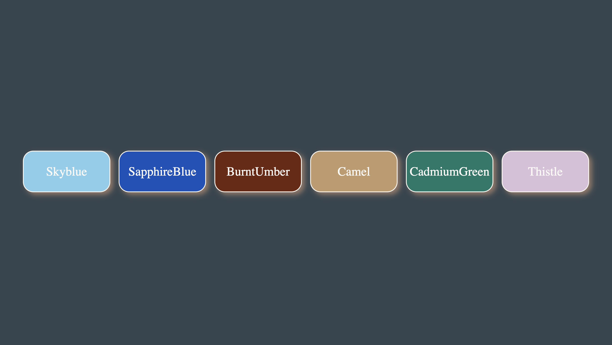
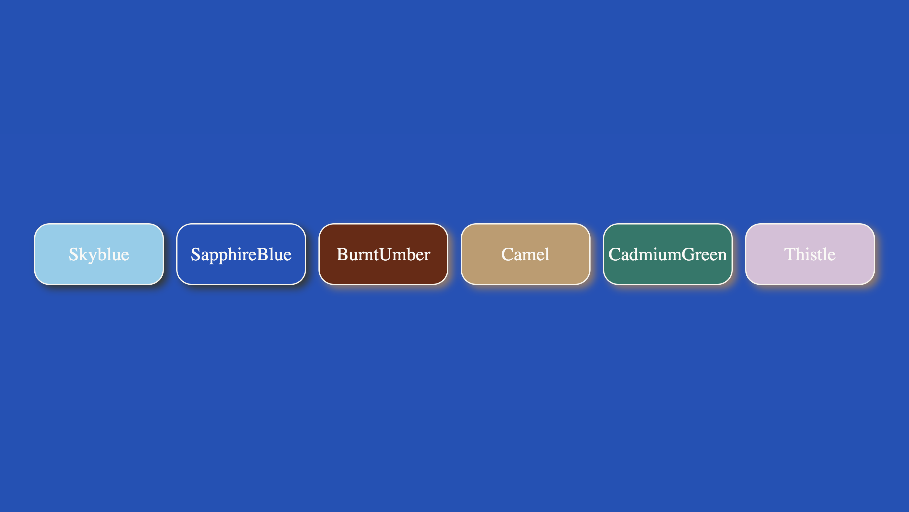
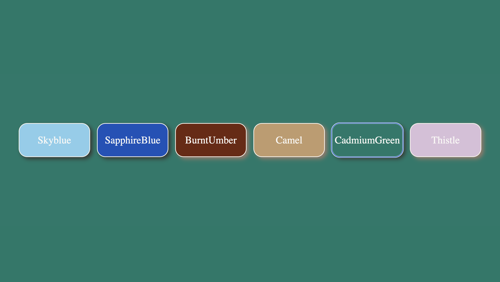

# Interchangeable-Colors-UI-
Interchangeable Colors UI 🎨  An interactive web project built using HTML, CSS, and JavaScript that changes the webpage background color dynamically when users click different color buttons. The project demonstrates DOM manipulation, event handling, dynamic class updates, flexbox layouts, and modern UI styling.

Before-Interchangeable

After-Interchangeable

